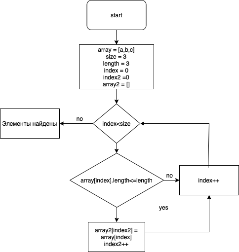

__Задача:__
Написать программу, которая из имеющегося массива строк формирует массив из строк, длинна которых меньше либо равна 3 символа.
Первоначальный массив можно ввести с клавиатуры, либо задать на страрте выполнения алгоритма. При решении не рекомендуется пользоваться коллекциями, лучше обойтись исключительно массивами.

Первоначальный массив вводится с клавиатуры. Длина массива фиксируется как 3 элемента.
Для решения создается второй массив, в который будет производиться запись элементов, соотвтетствующих требуемым условиям. 
На экран выводится первоначальный массив, и итоговый, соответствующий требованиям. 

